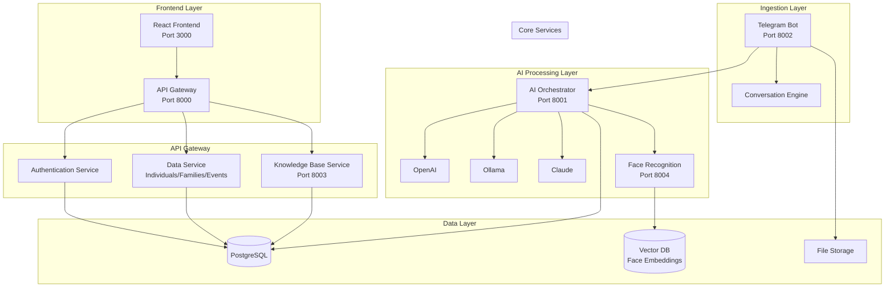
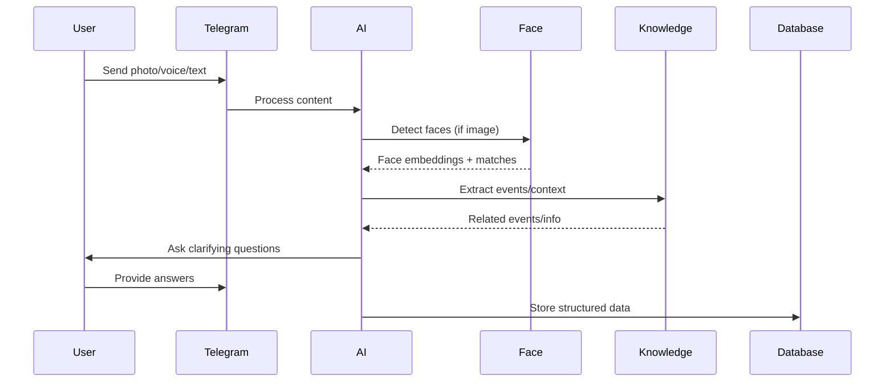

# Enhanced Genealogy App Architecture

## Overview
A comprehensive family tree management system with AI-powered ingestion, face recognition, and knowledge base capabilities.

## Services Architecture



## New Services

### 1. AI Orchestrator Service (Port 8001)
- Multi-AI backend support (OpenAI, Ollama, Claude)
- Intelligent AI selection based on task type
- Fallback mechanisms
- Cost optimization

### 2. Face Recognition Service (Port 8004)
- Face detection and embedding generation
- Face matching and clustering
- Photo-person correlation
- Support for multiple recognition models

### 3. Knowledge Base Service (Port 8003)
- Document ingestion and indexing
- Event extraction and correlation
- Calendar integration
- Semantic search capabilities

### 4. Conversation Engine
- Interactive questioning system
- Context-aware dialogue
- Relationship clarification
- Information gap detection

## Enhanced Data Flow



## Technology Stack

### Backend Services
- **Framework**: FastAPI (Python)
- **Database**: PostgreSQL + pgvector
- **AI**: OpenAI, Anthropic Claude, Ollama
- **Face Recognition**: FaceNet, InsightFace
- **Vector DB**: pgvector (PostgreSQL extension)
- **Message Queue**: Redis

### Frontend
- **Framework**: React 18 + TypeScript
- **UI**: TailwindCSS + shadcn/ui
- **Visualization**: D3.js, React Flow
- **State**: Zustand
- **Charts**: Recharts

### Infrastructure
- **Containerization**: Docker + Docker Compose
- **Reverse Proxy**: Nginx
- **File Storage**: MinIO (S3-compatible)
- **Monitoring**: Prometheus + Grafana

## Key Features Implementation

### 1. Multi-AI Backend Support
```python
class AIOrchestrator:
    def __init__(self):
        self.providers = {
            'openai': OpenAIProvider(),
            'claude': ClaudeProvider(), 
            'ollama': OllamaProvider()
        }
    
    async def process(self, task_type: str, content: str):
        provider = self.select_provider(task_type)
        return await provider.process(content)
```

### 2. Face Recognition Pipeline
```python
class FaceRecognitionService:
    async def process_image(self, image_path: str):
        faces = await self.detect_faces(image_path)
        embeddings = await self.generate_embeddings(faces)
        matches = await self.find_matches(embeddings)
        return self.correlate_with_persons(matches)
```

### 3. Knowledge Base Integration
```python
class KnowledgeService:
    async def ingest_document(self, document: Document):
        entities = await self.extract_entities(document)
        events = await self.extract_events(document)
        await self.index_for_search(document, entities, events)
```

### 4. Interactive Conversation
```python
class ConversationEngine:
    async def handle_ambiguity(self, extracted_data: dict):
        gaps = self.detect_information_gaps(extracted_data)
        questions = self.generate_clarifying_questions(gaps)
        return await self.ask_questions(questions)
```

## Database Schema Enhancements

### New Tables
- `face_embeddings` - Store face vectors
- `knowledge_documents` - Document storage
- `conversation_sessions` - Chat sessions
- `ai_providers` - AI configuration
- `event_correlations` - Event relationships

### Enhanced Tables
- `individuals` - Add face_id references
- `media` - Add face detection results
- `events` - Add knowledge base links

## Deployment Architecture

```yaml
services:
  nginx:
    image: nginx:alpine
    ports: ["80:80", "443:443"]
    
  api-gateway:
    image: genealogia/backend
    ports: ["8000:8000"]
    
  ai-orchestrator:
    image: genealogia/ai-service
    ports: ["8001:8001"]
    
  knowledge-service:
    image: genealogia/knowledge
    ports: ["8003:8003"]
    
  face-recognition:
    image: genealogia/face-service
    ports: ["8004:8004"]
    
  telegram-bot:
    image: genealogia/telegram-bot
    ports: ["8002:8002"]
    
  postgres:
    image: postgres:15+pgvector
    ports: ["5432:5432"]
    
  redis:
    image: redis:alpine
    ports: ["6379:6379"]
    
  minio:
    image: minio/minio
    ports: ["9000:9000", "9001:9001"]
```

## Security & Privacy

- **Data Encryption**: At rest and in transit
- **Face Data**: Secure storage with consent management
- **API Security**: JWT + API key authentication
- **Privacy Controls**: User-controlled data sharing
- **GDPR Compliance**: Right to deletion and data export

## Performance Considerations

- **Caching**: Redis for frequently accessed data
- **Async Processing**: Background jobs for heavy AI tasks
- **Load Balancing**: Multiple service instances
- **CDN**: Static asset delivery
- **Database Optimization**: Indexing and partitioning
